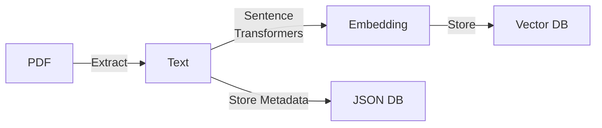
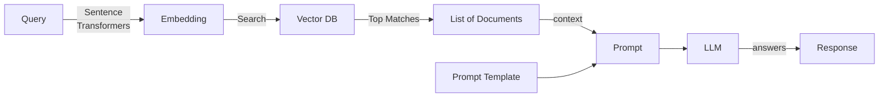

# Multi PDF Query Chatbot

This is a simple application where you can chat with the data residing in your PDF documents, be it a flight ticket, or some articles or some books. 
Basically, the application has two major features:
- You should be able to upload PDF files to it for processing and delete and update PDF documents as necessary.
- You should be able to query any natural language question about those PDF, and it should be intelligent enough to understand the context and answer relevant parts from it. It should not copy paste the text present in PDF, but understand it and rephrase the answer in its own terms.

The Basic idea is to showcase the RAG (Retrieval Augmented Generation) system with customized documents stored through a localized vector store database, along with metadata management.

## Code Design
### Processing PDF

The system to process and load the PDF is simple as shown.

1. The user uploads the PDF
2. We use the PyPDF2 package to parse the PDF.
    a. Check the `app/datastore.py` file, line 31. Here we use the PyPDFLoader class to load the PDF and parse the text from it.
3. Once we parse the text, we need to split it into chunks so that each chunk represents one coherent idea. It is like 2-3 paragraphs, spanning about 1000 characters, about 250 words.
    a. Check the `app/datastore.py` file, line 32-36. Here we use `RecursiveCharacterTextSplitter` class, which splits the text into chunks by looking for paragraph breaks, newlines or even word spaces.
4. After parsing, we compute the embedding of the chunks and save them to the vector DB. Here we use “chromadb” as a local vector database.
    a. Check `app/datastore.py` file, line 43 to see how we use the chroma client to calculate the embedding and store into the vector database.
    b. Check the `app/dependencies.py` file, line 15-17, we create the embedding functionality of `sentence-transformer` model.
    c. Then we pass that embedding function to Chroma client for it to use, see line 19 of same.
5. We also save some metadata for the file like its name, time of creation, and number of chunks.
    a. Check `app/datastore.py` file, line 49-55.

## Querying PDF
Querying the PDF also uses a linear flow as shown below.

1. First, the user asks the query.
2. We use the sentence-transformers model to get the embedding vector.
3. Then we search the embedding vector to get the closest matches in our chroma vector database.
    a. Check `app/datastore.py` file, line 80. 
    b. Here we use the same chroma client as a document retriever. 
    c. This will compute the embedding vector of the query.
    d. Then it will compute the dot product of this vector with every vector present in the database.
    e. It will return the top 4 documents with the largest dot product value.
    f. These are the 4 most similar document chunks.
4. Then we put these document text as context and put the query inside a prompt and call the Claude LLM to understand English comprehension and answer from the context.
    a. The prompt is given in `app/datastore.py`, line 81-98.
    b. Then we pass it to the `claude_completion` function.
    c. The claude_completion function is defined in `app/dependencies.py` file, line 25-32.
    d. We use the `claude-instant-1` model which is fast and provides reliable output.

## Licensing

- Please feel free to fork this repository and add your custom logic. 
- If you like the work, please star it and share it with others.
